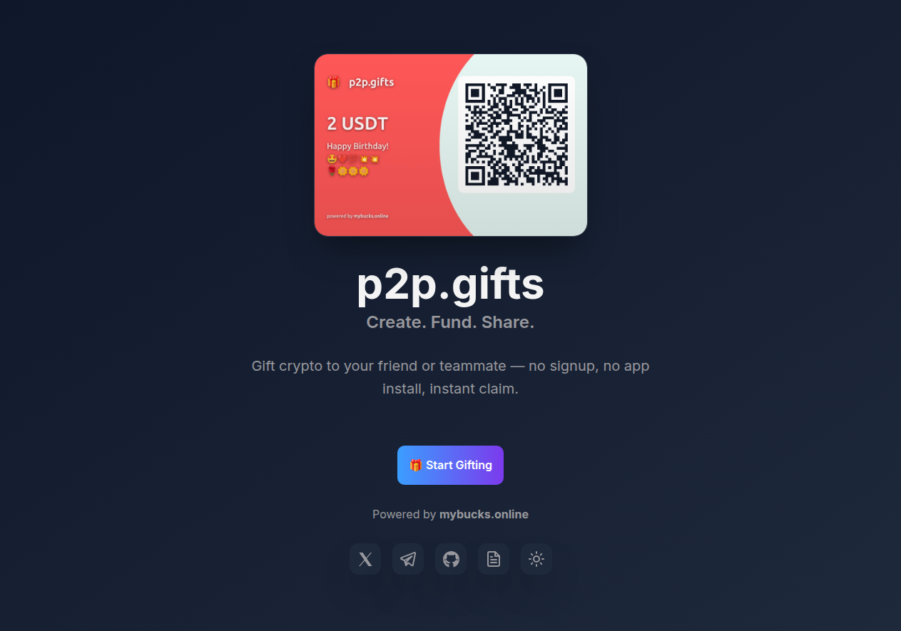
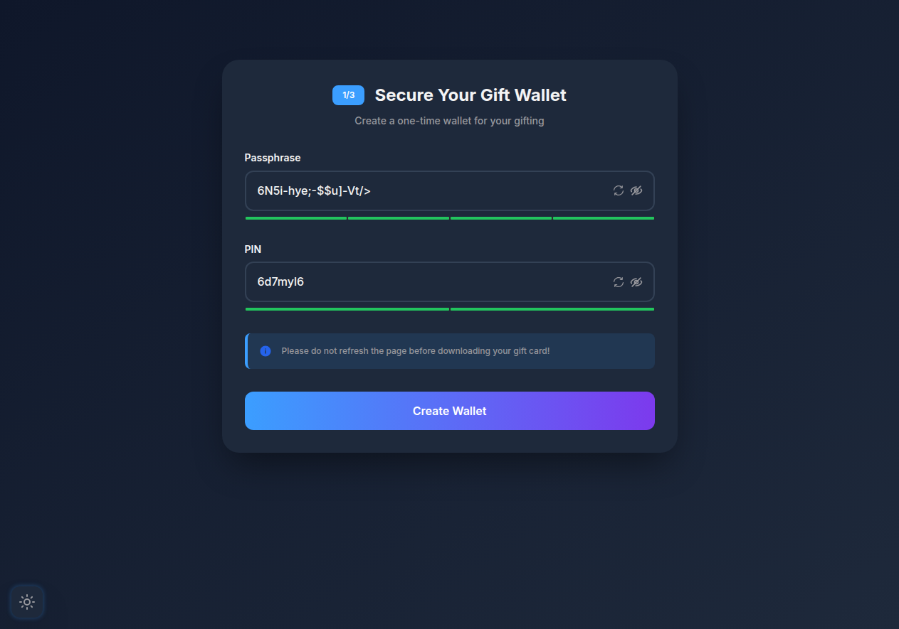
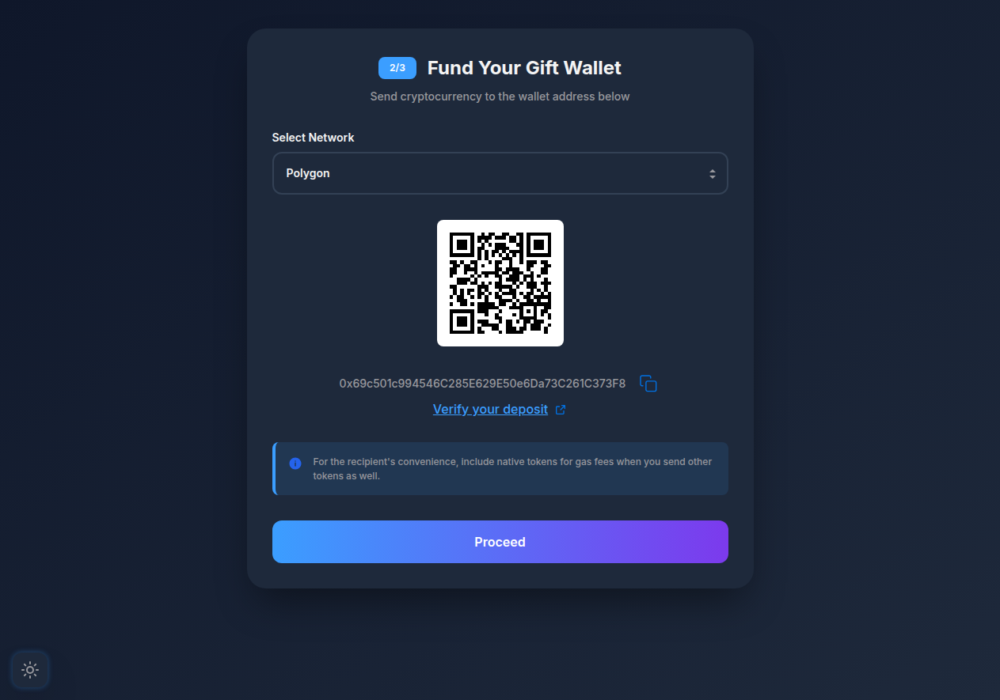
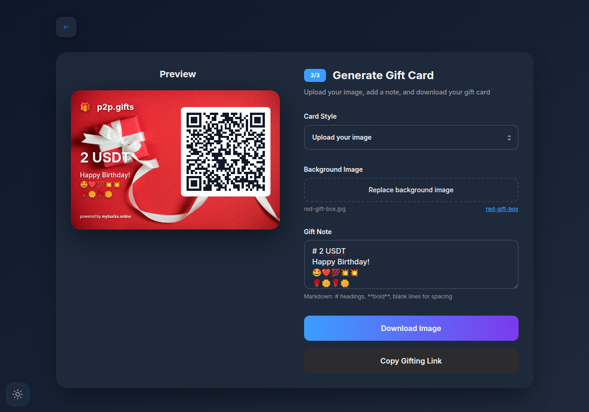

# p2p.gifts

Browser-only gifting wizard: create a disposable crypto gift wallet, fund it, and download a branded gift card with an embedded QR code.

Wallet generation and claiming are powered by [mybucks.online](https://mybucks.online) (seedless, self-custodial).

## Features

- No signup
- No app install
- Zero footprint (browser-only, nothing stored)
- Classic themes, custom backgrounds, and Markdown gift notes

## Flow

1. **Welcome** — value prop and CTA
2. **Create wallet** — passphrase + PIN (auto-generated)
3. **Fund** — send crypto to the gift wallet address
4. **Gift card** — pick a style, optional note, download PNG or copy the gifting link

Send the card by DM or email. Receivers scan the QR and claim on [app.mybucks.online](https://app.mybucks.online) — no signup, no app install.

## Screenshots

1. Welcome — 
2. Secure your gift wallet — 
3. Fund your gift wallet — 
4. Generate gift card — 

## Stack

- React + Vite, styled-components
- Wallet/crypto: [`@mybucks.online/core`](https://www.npmjs.com/package/@mybucks.online/core)
- Source alias: `@p2p-gifts/` → `src/`

## Run locally

```bash
yarn install
yarn dev
```

```bash
yarn build
```

## Links

- [p2p.gifts](https://p2p.gifts) · [mybucks.online](https://mybucks.online) · [Docs](https://docs.mybucks.online) · [GitHub](https://github.com/mybucks-online/p2p.gifts)

## License

MIT — see [LICENSE](LICENSE).

## Disclaimer

**p2p.gifts** is for micro-gifts only. Do not fund gift wallets with large amounts.

**p2p.gifts** and its developers are not responsible for any loss of funds in a gift wallet — including from not keeping your passphrase and PIN safe, or from sharing the gift card or gifting link in insecure places.

There is no reset or recovery. If you refresh or close the browser before you download the gift card or back up the gifting link, you may lose access to the wallet — that is your responsibility.
